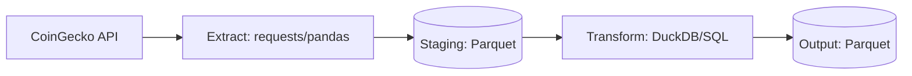

[](https://github.com/JSelemin/crypto_pipeline/blob/main/README.md)

# Crypto Analytics Pipeline

A modular ETL (Extract, Transform, Load) pipeline built with Python and DuckDB. This project orchestrates the collection of historical cryptocurrency data via the CoinGecko API and performs analytical transformations with SQL to generate market insights.

### Technologies

- Python

- SQL

- DuckDB

- requests

- pandas

### Architecture

The pipeline follows a structured ETL process:

1.  **Extraction**: Python `requests` fetches 1 year of historical market data (price, market cap, volume).

2.  **Staging**: Data is persisted into Parquet files.

3.  **Transformation**: DuckDB executes SQL-based analytical models, utilizing `window functions` and `relational joins` o produce final datasets.



### Analytical Models

The pipeline generates several specialized datasets located in `data/output/`:

- **Correlation Matrix**: A vertically stacked matrix (UNION ALL logic) showing the Pearson correlation coefficient between all tracked assets.

- **Daily Returns**: Demostrates the profit and loss ratios for each day compared to the previous.

- **Volatility**: Measures market risk using a 30-day rolling Standard Deviation of daily returns.

- **Rolling Averages**: 7-day (weekly) and 30-day (monthly) price trends using SQL window functions.

- **Market Dominance**: Calculates each asset's percentage of the total market cap within the tracked portfolio.

- **Top Movers**: A logic-heavy transformation that identifies the asset with the highest absolute daily movement for every week of the year.

### Execution

1. Install the necessary dependencies:

```bash
pip install -r requirements.txt
```

2. Configure environment variables (`.env.example` file):

```.env
API_KEY=your_coingecko_api_key_here
```

3. Run the pipeline:

```bash
python main.py
```