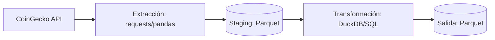

[](https://github.com/JSelemin/crypto_pipeline/blob/main/README.en.md)

# Crypto Analytics Pipeline

Un pipeline ETL (Extracción, Transformación y Carga) modular construido con Python y DuckDB. Este proyecto ejecuta la recolección de datos históricos de criptomonedas a través de la API de CoinGecko y realiza transformaciones analíticas con SQL para generar análisis de mercado.

### Tecnologías

- Python

- SQL

- DuckDB

- requests

- pandas

### Arquitectura

El pipeline sigue un proceso de ETL estructurado:

1.  **Extracción**: Python `requests` obtiene 1 año de datos históricos del mercado (precio, market cap, volumen).

2.  **Staging (Almacenamiento intermedio)**: Los datos se persisten en archivos Parquet.

3.  **Transformación**: DuckDB ejecuta modelos analíticos basados en SQL, utilizando `window functions` y `joins relacionales` para producir los datasets finales.



### Modelos Analíticos

El pipeline genera varios conjuntos de datos especializados ubicados en `data/output/`:

- **Correlation Matrix**: Una matriz apilada verticalmente (lógica UNION ALL) que muestra el coeficiente de correlación de Pearson entre todos los activos monitoreados.

- **Daily Returns**: Demuestra los ratios de ganancias y pérdidas de cada día en comparación con el anterior.

- **Volatility**: Mide el riesgo de mercado utilizando una desviación estándar móvil de 30 días de los retornos diarios.

- **Rolling Averages**: Tendencias de precios de 7 días (semanal) y 30 días (mensual) utilizando funciones de ventana de SQL.

- **Market Dominance**: Calcula el porcentaje de cada activo respecto a la capitalización total del mercado dentro del portfolio monitoreado.

- **Top Movers**: Una transformación de lógica compleja que identifica el activo con el mayor movimiento diario absoluto para cada semana del año.

### Ejecución

1. Instalar las dependencias necesarias:

```bash
pip install -r requirements.txt
```

2. Configurar las variables de entorno (archivo `.env.example`):

```.env
API_KEY=your_coingecko_api_key_here
```

3. Ejecutar el pipeline:

```bash
python main.py
```
